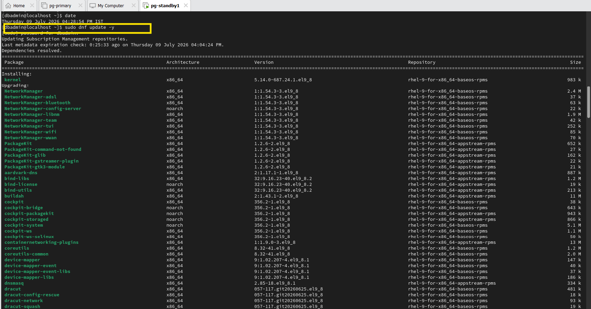
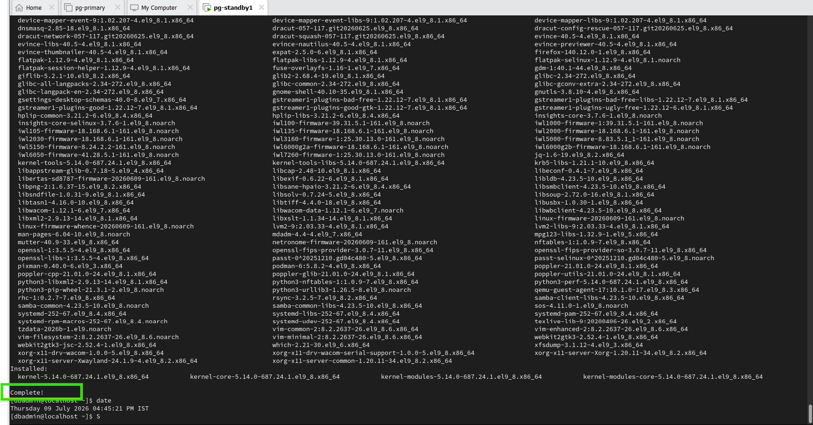
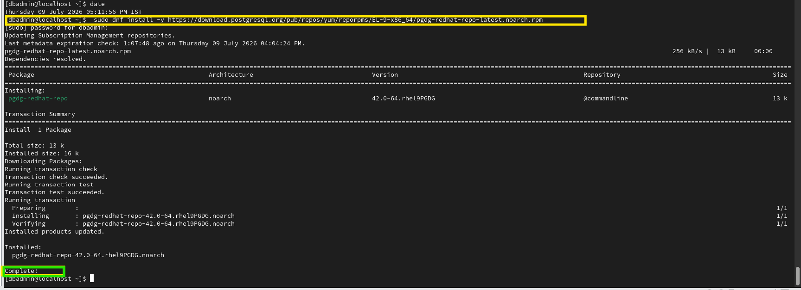
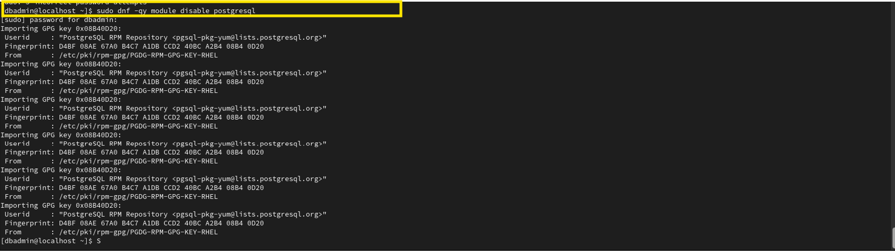
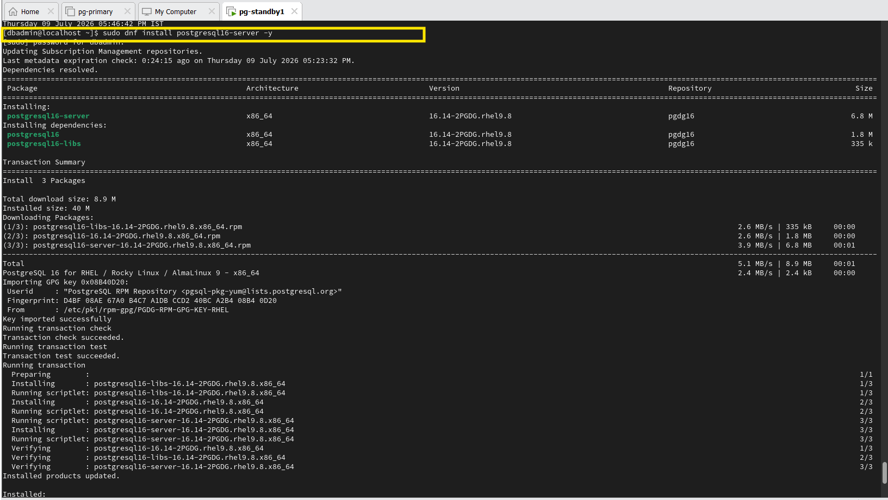
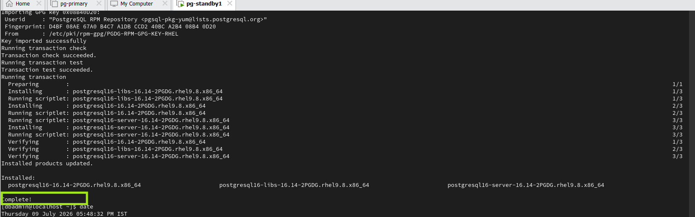
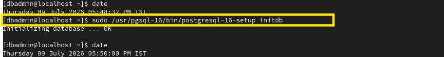
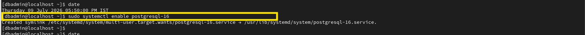
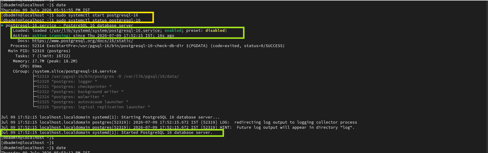
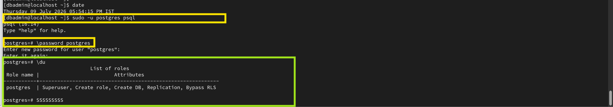

# PostgreSQL Installation Commands

This document contains the practical commands used to install PostgreSQL 16 on Red Hat Enterprise Linux 9.8.

---

# Step 1 - Update the Operating System

## Command

```bash
sudo dnf update -y
```

## Purpose

Updates all installed packages on the operating system to the latest available versions.

Running this command before installing PostgreSQL ensures that the operating system has the latest security updates, bug fixes, and required dependency packages.

## Command Breakdown

- **sudo** – Runs the command with administrative privileges.
- **dnf** – Default package manager in Red Hat Enterprise Linux 9.
- **update** – Updates all installed packages.
- **-y** – Automatically answers "Yes" to all confirmation prompts.

## Evidence



## Verification

The command completes successfully and the operating system packages are updated.


## Evidence




---

# Step 2 - Install the PostgreSQL PGDG Repository

## Command

```bash
sudo dnf install -y https://download.postgresql.org/pub/repos/yum/reporpms/EL-9-x86_64/pgdg-redhat-repo-latest.noarch.rpm
```

## Purpose

Installs the official PostgreSQL Global Development Group (PGDG) repository on Red Hat Enterprise Linux 9.8.

The default RHEL repositories may not provide the latest PostgreSQL version. Installing the PGDG repository allows the system to download PostgreSQL 16 packages directly from the official PostgreSQL repository.

## Command Breakdown

- **sudo** – Executes the command with administrative privileges.
- **dnf** – Package manager used in Red Hat Enterprise Linux 9.
- **install** – Installs a package.
- **-y** – Automatically answers "Yes" to all prompts.
- **https://download.postgresql.org/...** – Official PostgreSQL PGDG repository package.

## Verification

The following screenshot shows the execution of the command and the successful installation of the PostgreSQL PGDG repository package.




---

# Step 3 - Disable the Default PostgreSQL Module

## Command

```bash
sudo dnf -qy module disable PostgreSQL
```

## Purpose

Disables the default PostgreSQL module provided by the RHEL AppStream repository.

This ensures that PostgreSQL packages are installed from the official PostgreSQL Global Development Group (PGDG) repository instead of the operating system repository, preventing package version conflicts.

## Breakdown

- **sudo** – Executes the command with administrative privileges.
- **dnf** – Package manager used in RHEL 9.
- **-q** – Runs the command in quiet mode by suppressing unnecessary output.
- **-y** – Automatically answers "Yes" to confirmation prompts.
- **module** – Manages DNF software modules.
- **disable** – Disables the specified module.
- **PostgreSQL** – The default PostgreSQL AppStream module provided by RHEL.

## Evidence



## Verification

The PostgreSQL AppStream module is disabled successfully, and the command completes with a message similar to:

```text
Complete!
```

After this step, DNF installs PostgreSQL packages from the official PGDG repository instead of the RHEL AppStream repository. 

---

# Step 4 - Install PostgreSQL 16 Server

## Command

```bash
sudo dnf install postgresql16-server -y
```

## Purpose

Installs the PostgreSQL 16 server package from the official PostgreSQL Global Development Group (PGDG) repository.

This package contains the PostgreSQL database server, client utilities, libraries, and other components required to run a PostgreSQL database server.

## Breakdown

- **sudo** – Executes the command with administrative privileges.
- **dnf** – Package manager used in RHEL 9.
- **install** – Installs the specified software package.
- **postgresql16-server** – PostgreSQL 16 server package.
- **-y** – Automatically answers "Yes" to all confirmation prompts.

## Evidence

### Command Execution



### Successful Installation



## Verification

The PostgreSQL 16 server package and all required dependencies are installed successfully. Once the installation is complete, DNF displays a message similar to:

```text
Complete!
```

At this stage, PostgreSQL is installed on the server. The next step is to initialize the PostgreSQL database cluster before starting the PostgreSQL service.


---

# Step 5 - Initialize the PostgreSQL Database Cluster

## Command

```bash
sudo /usr/pgsql-16/bin/postgresql-16-setup initdb
```

## Purpose

Initializes the PostgreSQL database cluster by creating the required data directory, system databases, configuration files, and directory structure.

Although PostgreSQL is installed on the server, it cannot be used until the database cluster is initialized.

## Breakdown

- **sudo** – Executes the command with administrative privileges.
- **/usr/pgsql-16/bin/postgresql-16-setup** – PostgreSQL setup utility used to configure a PostgreSQL 16 server.
- **initdb** – Initializes a new PostgreSQL database cluster.

## Evidence



## Verification

The PostgreSQL database cluster is initialized successfully. During this process, PostgreSQL creates the data directory, default system databases, and configuration files such as `postgresql.conf` and `pg_hba.conf`.

---

# Step 6 - Enable the PostgreSQL Service

## Command

```bash
sudo systemctl enable postgresql-16
```

## Purpose

Configures the PostgreSQL 16 service to start automatically whenever the operating system boots.

Enabling the service ensures that PostgreSQL starts automatically after a system restart, eliminating the need to start it manually each time the server is rebooted.

## Breakdown

- **sudo** – Executes the command with administrative privileges.
- **systemctl** – Utility used to manage systemd services.
- **enable** – Configures the service to start automatically during system boot.
- **postgresql-16** – The PostgreSQL 16 service.

## Evidence



## Verification

The PostgreSQL service is successfully enabled. A symbolic link is created so that the PostgreSQL service starts automatically during system startup.

A successful execution displays a message similar to:

---

# Step 7 - Start and Verify the PostgreSQL Service

## Commands

```bash
sudo systemctl start postgresql-16
sudo systemctl status postgresql-16
```

## Purpose

The first command starts the PostgreSQL 16 service immediately. The second command verifies that the PostgreSQL service is running correctly and displays its current status.

## Breakdown

### Command 1

```bash
sudo systemctl start postgresql-16
```

- **sudo** – Executes the command with administrative privileges.
- **systemctl** – Utility used to manage systemd services.
- **start** – Starts the specified service immediately.
- **postgresql-16** – The PostgreSQL 16 service.

### Command 2

```bash
sudo systemctl status postgresql-16
```

- **sudo** – Executes the command with administrative privileges.
- **systemctl** – Utility used to manage systemd services.
- **status** – Displays the current status of the service.
- **postgresql-16** – The PostgreSQL 16 service.

## Evidence



## Verification

The PostgreSQL service starts successfully, and the status command confirms that the service is running.

A successful status output displays information similar to:

```text
Active: active (running)
```

This confirms that the PostgreSQL server is running and ready to accept client connections.


---

# Step 8 - Reload the PostgreSQL Service

## Command

```bash
sudo systemctl reload postgresql-16
```

## Purpose

Reloads the PostgreSQL service without stopping or restarting the database server.

This command is typically used after making changes to PostgreSQL configuration files that support a configuration reload. It allows the server to apply the new settings while continuing to accept client connections.

## Breakdown

- **sudo** – Executes the command with administrative privileges.
- **systemctl** – Utility used to manage systemd services.
- **reload** – Reloads the service configuration without restarting the service.
- **postgresql-16** – The PostgreSQL 16 service.

## Evidence


## Verification

The PostgreSQL service reloads successfully without interrupting existing database connections.

If the configuration files contain valid settings, the command completes without displaying any error messages.

---

# Step 9 - Connect to PostgreSQL and Configure the Superuser Password

## Commands

```bash
sudo -u postgres psql
```

```sql
\password postgres
```

```sql
\du
```

## Purpose

The first command connects to the PostgreSQL server using the default PostgreSQL superuser (`postgres`). After connecting, the password for the `postgres` user is set to improve security. Finally, the `\du` command is used to verify the available database roles and their assigned privileges.

## Breakdown

### Command 1

```bash
sudo -u postgres psql
```

- **sudo** – Executes the command with administrative privileges.
- **-u postgres** – Runs the command as the PostgreSQL operating system user.
- **psql** – Starts the PostgreSQL interactive command-line client.

### Command 2

```sql
\password postgres
```

- **\password** – PostgreSQL meta-command used to change a user's password.
- **postgres** – The PostgreSQL superuser account.

### Command 3

```sql
\du
```

- **\du** – Lists all PostgreSQL database roles and their assigned privileges.

## Evidence



## Verification

The PostgreSQL interactive terminal (`psql`) opens successfully. The password for the `postgres` superuser is updated after entering and confirming the new password. Running the `\du` command displays the available roles and confirms that the `postgres` user has superuser privileges.


```

