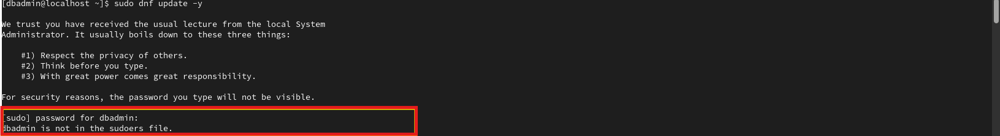
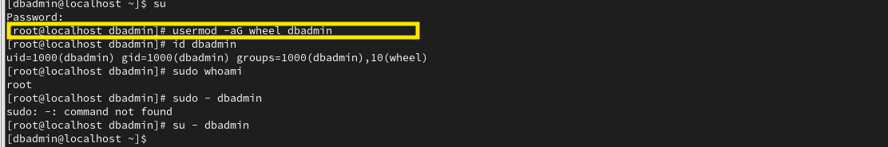
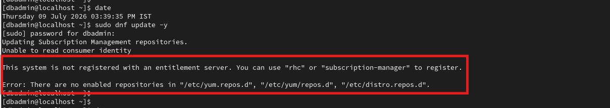
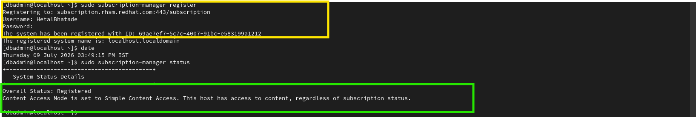

# PostgreSQL Installation Troubleshooting

This document contains issues encountered during the PostgreSQL installation process and the steps taken to resolve them.

---

## Environment

- Operating System: Red Hat Enterprise Linux 9.8
- PostgreSQL Version: 16
- Installation Method: PGDG Repository


# Issue 1 - Sudo Permission Error

## Problem

While preparing the server for PostgreSQL installation, the `dbadmin` user did not have sudo privileges. As a result, administrative commands required for installation could not be executed.

## Error Evidence



## Resolution

The `dbadmin` user was added to the `wheel` group to grant sudo privileges.

### Commands Used

```bash
sudo su -

usermod -aG wheel dbadmin

id dbadmin

sudo whoami

su - dbadmin
```

## Resolution Evidence



## Result

The `dbadmin` user successfully obtained sudo privileges and was able to execute administrative commands required for PostgreSQL installation.

## Lesson Learned

On Red Hat Enterprise Linux, users must belong to the `wheel` group to use the `sudo` command.

---

# Issue 2 - Red Hat Subscription Manager Registration

## Problem

Before installing PostgreSQL from the PGDG repository, the operating system was not registered with Red Hat Subscription Manager. Because of this, access to required repositories was unavailable.

## Error Evidence



## Resolution

The operating system was registered with Red Hat Subscription Manager and an available subscription was attached.

### Commands Used

```bash
sudo subscription-manager register

sudo subscription-manager status
```

## Resolution Evidence



## Result

The system was successfully registered, the subscription was attached, and the required repositories became available for PostgreSQL installation.

## Lesson Learned

Always verify that the RHEL server is registered with Red Hat Subscription Manager before installing software packages from official repositories.

---

- 
