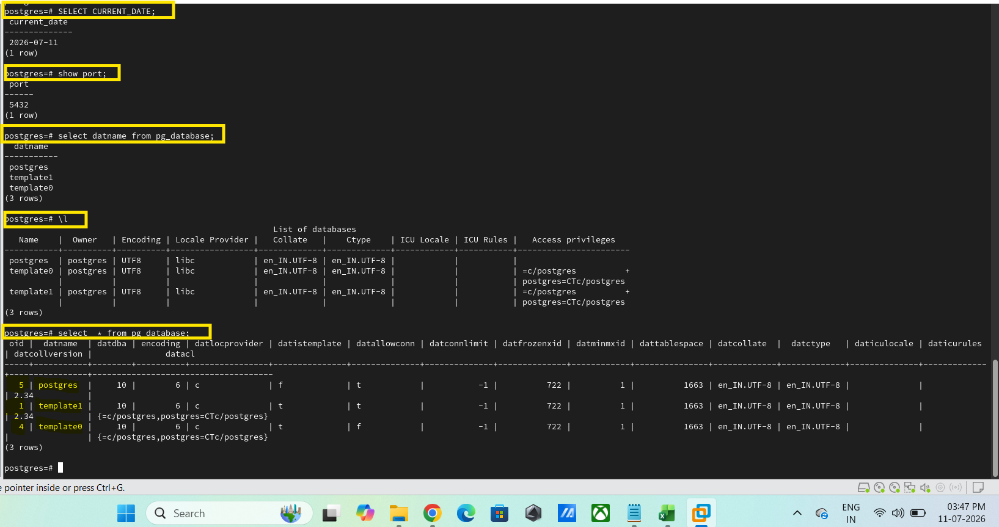
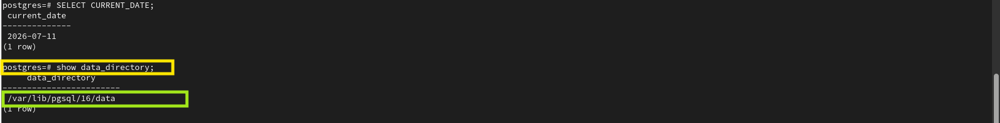
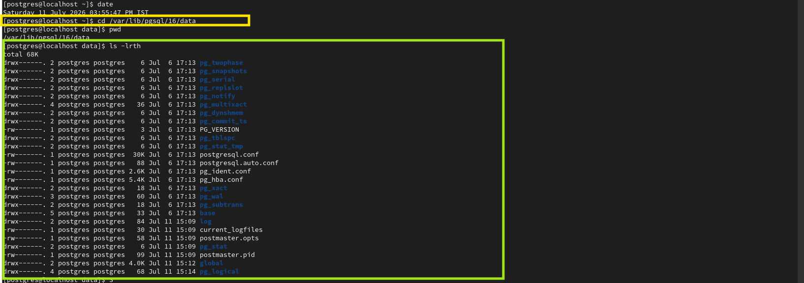
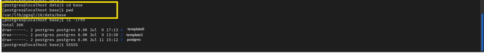
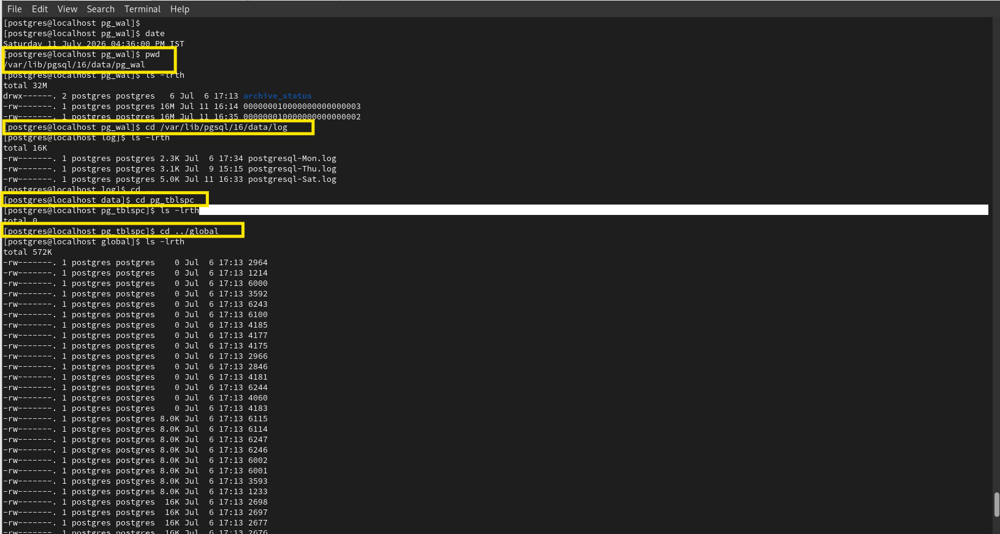

# PostgreSQL Cluster Architecture Commands

This document contains the practical SQL queries and Linux commands used to explore the PostgreSQL database cluster, data directory, and important cluster components.

---

# Step 1 - Display Basic PostgreSQL Information

## Command

```sql
SHOW port;

SHOW data_directory;

SELECT datname FROM pg_database;

SELECT spcname FROM pg_tablespace;
```

## Purpose

Displays the PostgreSQL server port, data directory location, available databases, and configured tablespaces.

## Breakdown

- `SHOW port;` - Displays the TCP port on which the PostgreSQL server is listening.
- `SHOW data_directory;` - Displays the location of the PostgreSQL data directory.
- `SELECT datname FROM pg_database;` - Lists all databases available in the PostgreSQL cluster.
- `SELECT spcname FROM pg_tablespace;` - Lists all available tablespaces.

## Verification

The commands execute successfully and display the PostgreSQL server port, data directory path, available databases, and tablespaces.



---

# Step 2 - Display PostgreSQL Data Directory

## Command

```bash
cd /var/lib/pgsql/16/data

pwd

ls -lrth
```

## Purpose

Navigates to the PostgreSQL data directory and displays its location and contents.

## Breakdown

- `cd` - Changes the current directory to the PostgreSQL data directory.
- `pwd` - Displays the current working directory.
- `ls -lrth` - Lists the contents of the directory in a detailed and human-readable format.

## Verification

The PostgreSQL data directory is displayed successfully, showing the directories and files that make up the PostgreSQL database cluster.





---

# Step 3 - Display Base Directory Contents

## Command

```bash
cd base

pwd

ls -lrth
```

## Purpose

Displays the contents of the PostgreSQL base directory, where the physical files of each database are stored.

## Breakdown

- `cd base` - Opens the PostgreSQL base directory.
- `pwd` - Displays the current directory path.
- `ls -lrth` - Lists all database directories.

## Verification

The base directory is displayed successfully, showing directories that represent databases within the PostgreSQL cluster.



---

# Step 4 - Display Database OID Mapping

## Command

```sql
SELECT datname, oid
FROM pg_database;
```

## Purpose

Displays the Object Identifier (OID) assigned to each database in the PostgreSQL cluster.

## Breakdown

- `datname` - Displays the database name.
- `oid` - Displays the unique Object Identifier assigned to each database.

The OID corresponds to the directory name created inside the PostgreSQL `base` directory.

## Verification

The database names and their corresponding OIDs are displayed successfully. These OIDs match the directory names located under the `base` directory.



---

# Step 5 - Display Other Important Data Directory Files

## Command

```bash
cd /var/lib/pgsql/16/data/pg_wal
cd /var/lib/pgsql/16/data/log
cd /var/lib/pgsql/16/data/pg_tblspc
cd /var/lib/pgsql/16/data/global

ls -lrth
```

## Purpose

Displays the important directories and files present inside the PostgreSQL data directory.

## Breakdown

The PostgreSQL data directory contains several important directories and files, including:

- `base` - Stores the physical files for each database.
- `global` - Stores cluster-wide system catalogs and metadata.
- `pg_tblspc` - Stores symbolic links for user-defined tablespaces.
- `pg_wal` - Stores Write-Ahead Log (WAL) files.
- `log` - Stores PostgreSQL log files (when configured).
- `postmaster.pid` - Stores information about the running PostgreSQL server process.
- `postmaster.opts` - Stores the startup options used to start the PostgreSQL server.
- `pg_hba.conf` - Host-Based Authentication configuration file.

## Verification

The PostgreSQL data directory is displayed successfully, showing the important directories and files used by the PostgreSQL database cluster.


