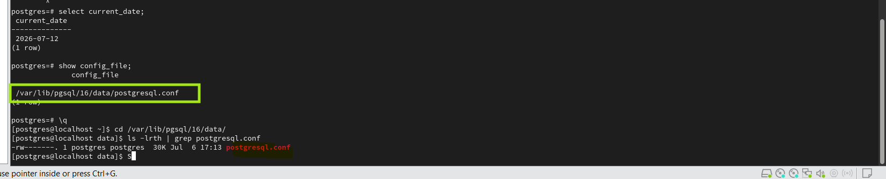
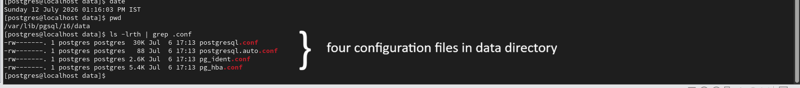
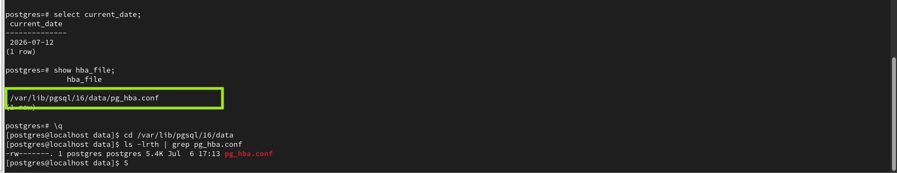
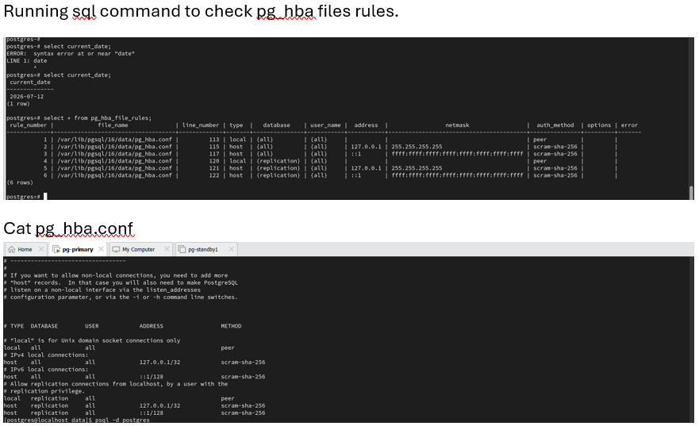
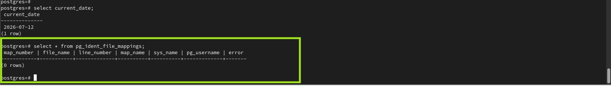
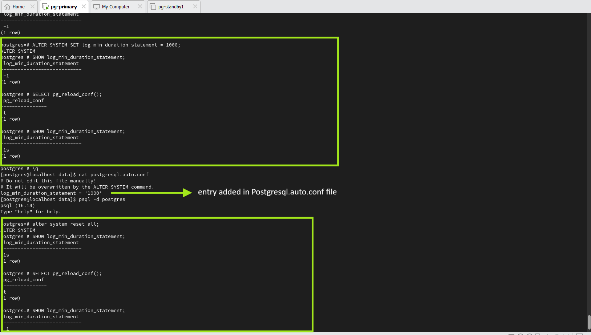
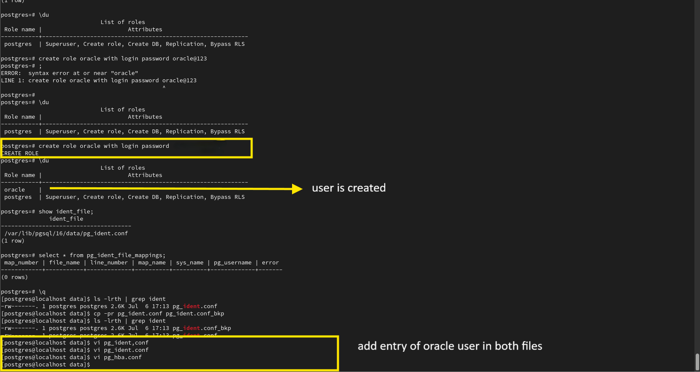
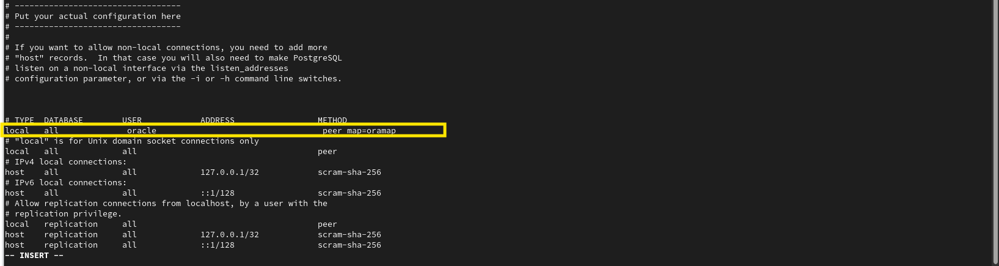
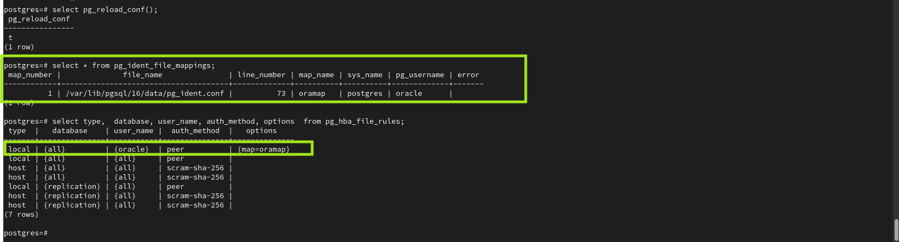

# PostgreSQL Configuration File Commands

This document contains the SQL queries and Linux commands used to explore PostgreSQL configuration files, inspect their contents, modify configuration parameters, and verify configuration changes.

---

# Step 1 - View PostgreSQL Configuration File Locations

## Purpose

Display the location of the PostgreSQL configuration files.

## Commands

```sql
SHOW config_file;

SHOW hba_file;

SHOW ident_file;

SHOW data_directory;
```

## Evidence







---

# Step 2 - View pg_hba.conf Content

## Purpose

Display the contents of the Host-Based Authentication configuration file and verify the authentication rules currently loaded by PostgreSQL.

## Commands

```bash
cat pg_hba.conf
```

```sql
SELECT
    type,
    database,
    user_name,
    auth_method,
    options
FROM pg_hba_file_rules;
```

## Evidence



---

# Step 3 - View Default pg_ident.conf

## Purpose

Display the default contents of the PostgreSQL user mapping configuration file before making any changes.

## Commands

```bash
cat pg_ident.conf
```

## Evidence



---

# Step 4 - Modify Configuration Using ALTER SYSTEM

## Purpose

Modify a PostgreSQL configuration parameter using ALTER SYSTEM and verify that the change is written to postgresql.auto.conf.

## Commands

```sql
SHOW log_min_duration_statement;

ALTER SYSTEM SET log_min_duration_statement = 1000;

SELECT pg_reload_conf();

SHOW log_min_duration_statement;
```

```bash
cat postgresql.auto.conf
```

## Evidence



---

# Step 5 - Create Test Role for pg_ident.conf

## Purpose

Create a PostgreSQL role used for demonstrating username mapping through pg_ident.conf.

## Commands

```sql
\du

CREATE ROLE oracle
LOGIN
PASSWORD 'Oracle@1234';

\du
```

## Evidence



---

# Step 6 - Update pg_ident.conf and pg_hba.conf

## Purpose

Create a backup of pg_ident.conf, update the authentication configuration files, and reload the PostgreSQL configuration.

## Commands

```bash
cp -pr pg_ident.conf pg_ident.conf_bkp

vi pg_ident.conf

vi pg_hba.conf
```

```sql
SELECT pg_reload_conf();
```

## Evidence



---

# Step 7 - Verify pg_ident.conf Mapping

## Purpose

Verify that PostgreSQL successfully loaded the username mappings defined in pg_ident.conf.

## Commands

```sql
SELECT *
FROM pg_ident_file_mappings;
```

## Evidence



---

# Step 8 - Verify pg_hba.conf Rules

## Purpose

Verify the authentication rules currently loaded from pg_hba.conf.

## Commands

```sql
SELECT
    type,
    database,
    user_name,
    auth_method,
    options
FROM pg_hba_file_rules;
```

## Evidence


