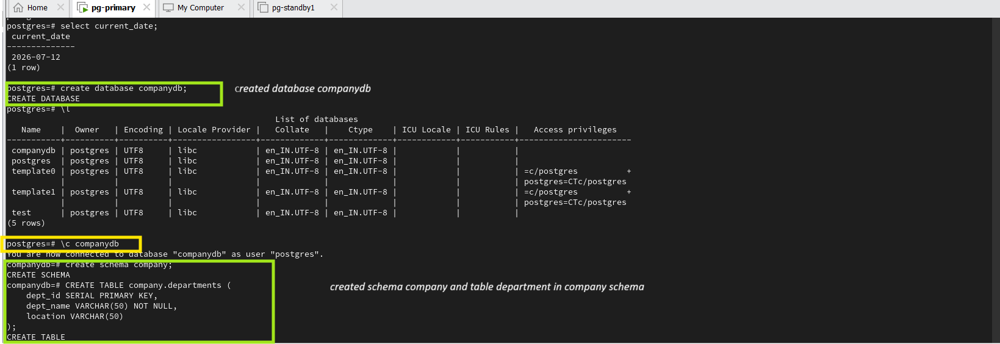
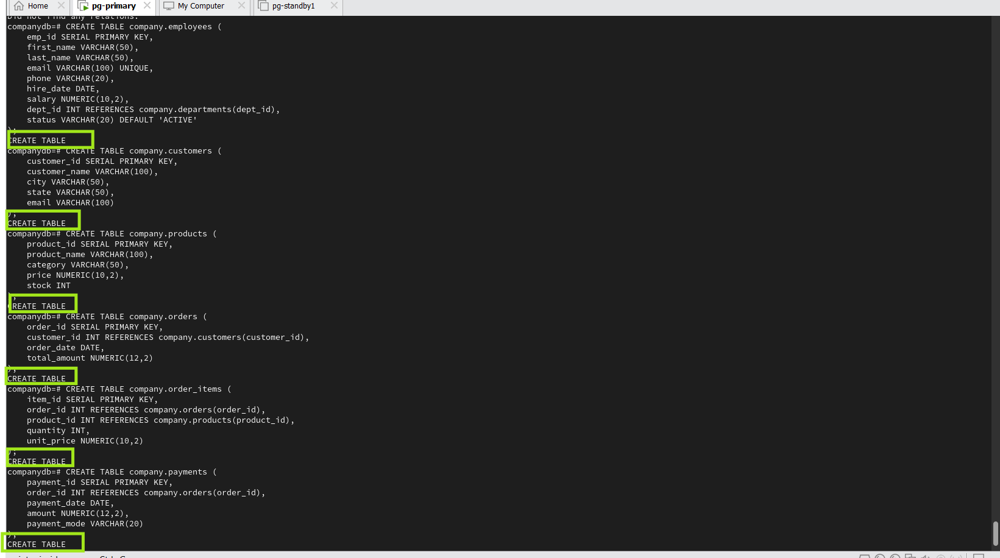
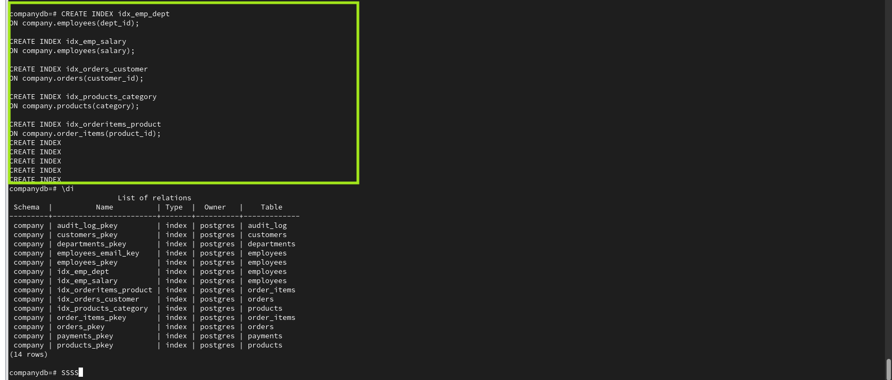
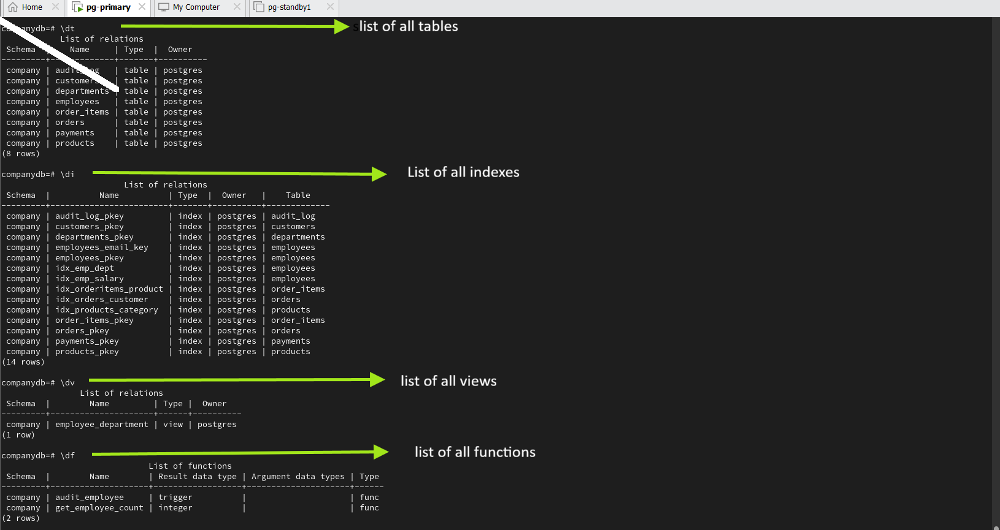
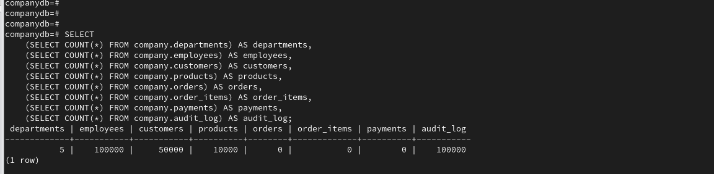

# PostgreSQL Database Lab Setup Commands

This document contains the SQL commands used to create the sample PostgreSQL database and verify the database objects used throughout the PostgreSQL Administration lab.

---

# Step 1 - Create Database and Database Objects

## Purpose

Create the sample PostgreSQL database together with the database objects required for the PostgreSQL Administration lab.

## Commands

Create the database and schema:

```sql
CREATE DATABASE companydb;

\c companydb

CREATE SCHEMA company;
```

The complete SQL script used to create the remaining database objects is available in:

- `scripts/companydb_lab_setup.sql`

The script includes:

- Schema
- Tables
- Constraints
- Indexes
- Views
- Functions
- Triggers
- Sample Data

## Evidence







---

# Step 2 - Verify Database Objects

## Purpose

Verify that all database objects were created successfully.

## Commands

```sql
\dt

\di

\dv

\df
```

## Evidence



---

# Step 3 - Verify Sample Data

## Purpose

Verify that sample data has been successfully inserted into the tables.

## Commands

```sql
SELECT COUNT(*) FROM company.departments;

SELECT COUNT(*) FROM company.employees;

SELECT COUNT(*) FROM company.customers;

SELECT COUNT(*) FROM company.products;

SELECT COUNT(*) FROM company.orders;

SELECT COUNT(*) FROM company.order_items;

SELECT COUNT(*) FROM company.payments;
```

## Evidence


