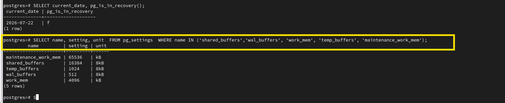

# PostgreSQL Memory Architecture Commands

This document contains the SQL commands used to view PostgreSQL memory configuration and verify memory-related parameters.

---

# Step 1 - View PostgreSQL Memory Parameters

## Purpose

Display the primary PostgreSQL memory configuration parameters.

## Commands

```sql
SHOW shared_buffers;

SHOW wal_buffers;

SHOW work_mem;

SHOW temp_buffers;

SHOW maintenance_work_mem;
```

## Description

These commands display the current values of the most commonly used PostgreSQL memory parameters.

- `shared_buffers` – Shared memory used to cache table and index pages.
- `wal_buffers` – Shared memory used to temporarily store WAL records.
- `work_mem` – Local memory used for sorting and hash operations.
- `temp_buffers` – Local memory used for temporary tables.
- `maintenance_work_mem` – Local memory used during maintenance operations.

## Evidence


---

# Step 2 - View Memory Configuration from pg_settings

## Purpose

Display detailed memory configuration values from the PostgreSQL system catalog.

## Command

```sql
SELECT
    name,
    setting,
    unit
FROM pg_settings
WHERE name IN
(
'shared_buffers',
'wal_buffers',
'work_mem',
'temp_buffers',
'maintenance_work_mem'
);
```

## Description

The `pg_settings` system catalog provides detailed information about PostgreSQL configuration parameters, including the configured value and measurement unit.

Unlike the `SHOW` command, `pg_settings` allows querying multiple parameters together and is commonly used by DBAs for monitoring and configuration verification.

## Evidence


