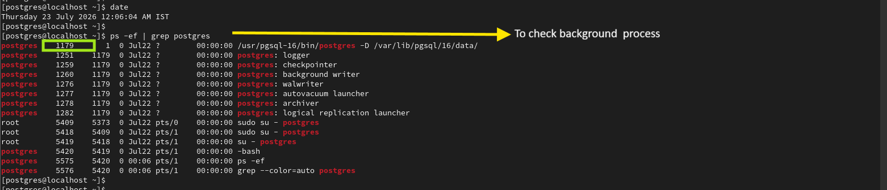
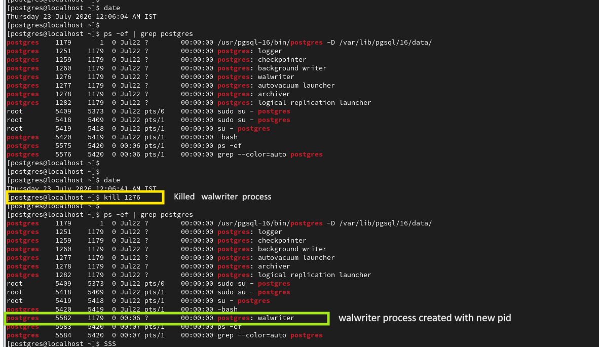

# PostgreSQL Background Processes Commands

This document contains the Linux commands used to view PostgreSQL background processes and verify PostgreSQL process supervision.

---

# Step 1 - View PostgreSQL Background Processes

## Purpose

Display the PostgreSQL server processes running on the operating system.

## Command

```bash
ps -ef | grep postgres
```

## Description

This command lists all PostgreSQL processes currently running.

Typical processes include:

- Postmaster
- Checkpointer
- Background Writer
- WAL Writer
- Autovacuum Launcher
- Logger
- Logical Replication Launcher

## Evidence



---

# Step 2 - Verify Automatic Process Recovery

## Purpose

Verify that PostgreSQL automatically recreates a background process if it unexpectedly terminates.

## Command

Example:

```bash
kill -9 <wal_writer_pid>

ps -ef | grep postgres
```

## Description

In this demonstration, the WAL Writer process was terminated.

The postmaster process automatically detected the failure and immediately created a new WAL Writer process.

This behavior demonstrates PostgreSQL's built-in process supervision mechanism, which helps maintain database stability.

## Evidence


