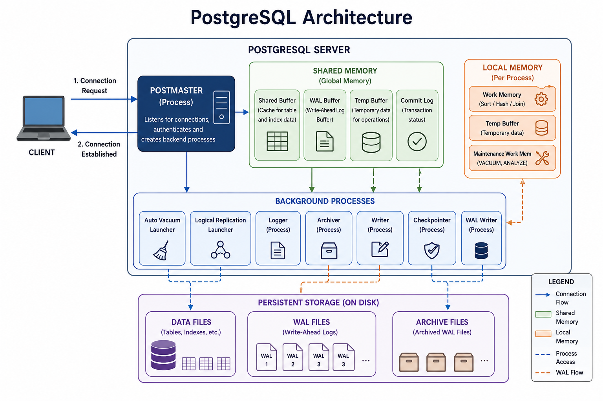

# PostgreSQL Memory Architecture

## Overview

After understanding PostgreSQL's client-server architecture and data directory layout, the next step is understanding how PostgreSQL manages memory.

Instead of reading data from disk for every request, PostgreSQL uses memory to cache frequently accessed data and provide working space for query execution.

PostgreSQL memory can be broadly divided into:

- **Shared Memory** – Memory shared by all backend processes.
- **Local Memory** – Private memory allocated for each backend process.

---

## PostgreSQL Memory Architecture

The following diagram provides a high-level overview of the PostgreSQL server architecture.

Although it also illustrates background processes and persistent storage, this module focuses specifically on the memory components used by PostgreSQL.

**Shared Memory components covered in this module:**

- Shared Buffers
- WAL Buffers

**Local Memory components covered in this module:**

- work_mem
- temp_buffers
- maintenance_work_mem

The background processes shown in the diagram are covered separately in the **Background Processes** module.

---

# Shared Memory

## Definition

Shared Memory is allocated when the PostgreSQL server starts and is shared by all backend processes.

Its primary purpose is to reduce disk I/O by caching frequently accessed data and temporarily storing WAL records before they are written to disk.

### Main Components

- Shared Buffers
- WAL Buffers

...
