# PostgreSQL Logical Backup and Restore Commands

This document contains the commands used to perform logical backup and restore operations using PostgreSQL utilities.

Each section includes the purpose, command syntax, and evidence captured during the lab.

---

# Part 1 - Prepare Backup Directory

## Step 1 - Create Backup Directory

### Purpose

Create a dedicated directory to store PostgreSQL backup files.

### Commands

```bash
mkdir backup

cd backup
```

### Evidence

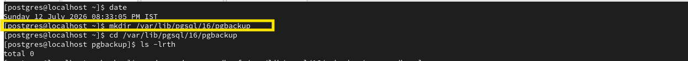

---

## Step 2 - Take Backup using various format  

### Purpose

Create a logical backup of the SchoolDB database using pg_dump in Custom format.

### Command Syntax

```bash
# Plain SQL Backup
pg_dump -d <database_name> -f <output_file.sql>

# Tar Format Backup
pg_dump -Ft -d <database_name> -f <output_file.tar>

# Directory Format Backup
pg_dump -Fd -d <database_name> -f <output_directory>

# Custom Format Backup
pg_dump -Fc -d <database_name> -f <output_file.backup>

# Backup a Specific Table
pg_dump -d <database_name> -t <schema_name.table_name> -f <output_file.sql>

# Backup Multiple Tables
pg_dump -d <database_name> \
-t <schema.table1> \
-t <schema.table2> \
-t <schema.table3> \
-f <output_file.sql>

# Backup a Specific Schema
pg_dump -d <database_name> -n <schema_name> -f <output_file.sql>

# Exclude a Table
pg_dump -d <database_name> -T <schema_name.table_name> -f <output_file.sql>

# Verbose Backup
pg_dump -v -d <database_name> -f <output_file.sql>

# Compressed Custom Format Backup
pg_dump -Fc -Z<compression_level> -d <database_name> -f <output_file.backup>

# Schema-Only Backup
pg_dump -s -d <database_name> -f <output_file.sql>

# Data-Only Backup
pg_dump -a -d <database_name> -f <output_file.sql>
```

### Evidence

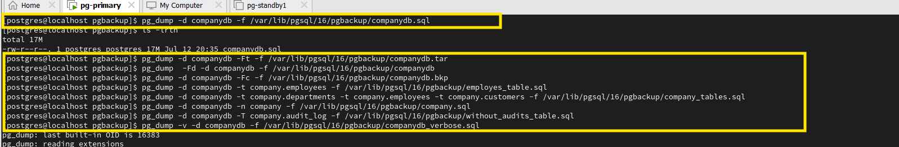

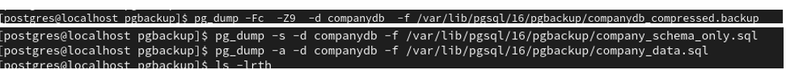

Check in backup directory if backups exist or not 

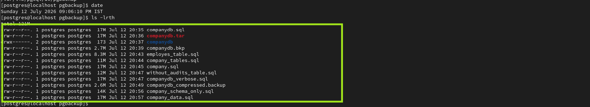

pg_dump options

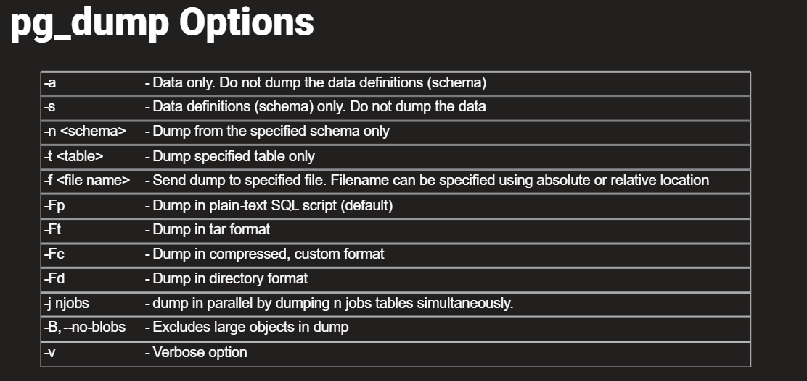

---


# Part 2 - Restore Entire Database

## Step 3 - Verify Backup File

### Purpose

Verify that the custom backup file was created successfully.

### Evidence

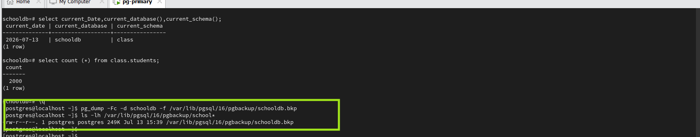

---

## Step 4 - Drop Existing Database

### Purpose

Simulate database loss before performing a full restore.

### Command Syntax

```sql
DROP DATABASE schooldb;
```

### Evidence

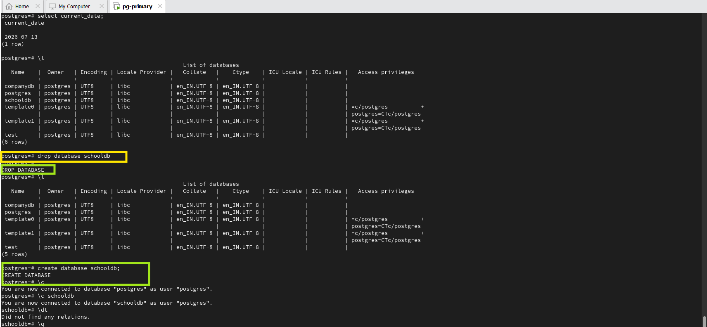

---

## Step 5 - Restore Database

### Purpose

Restore the complete database using pg_restore.

### Command Syntax

```bash
pg_restore -d schooldb schooldb.backup
```

### Evidence

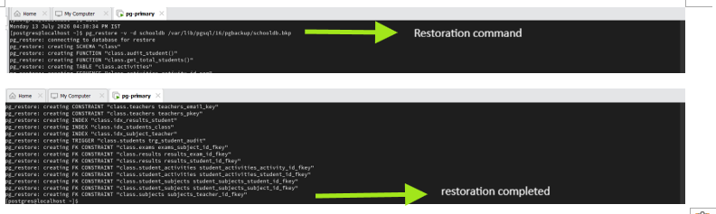

---

## Step 6 - Verify Database Restore

### Purpose

Verify that all database objects and data were restored successfully.

### Evidence

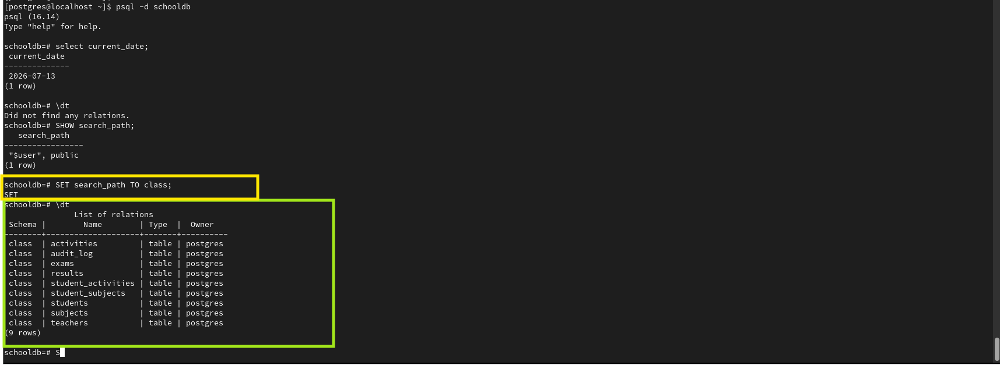

---

# Part 3 - Backup and Restore Individual Table

## Step 7 - Backup Teachers Table

### Purpose

Create a logical backup of the Teachers table.

### Evidence

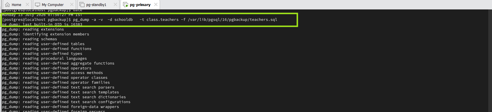

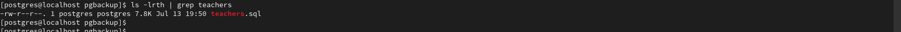

---

## Step 8 - Remove Teacher Data

### Purpose

Truncate the Teachers table before restoring.

### Evidence

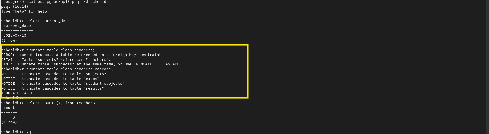

---

## Step 9 - Restore Teachers Table

### Purpose

Restore the Teachers table from the backup.

### Evidence

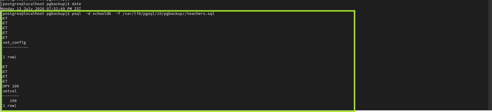

---

## Step 10 - Verify Teacher Restore

### Purpose

Verify that all teacher records were restored successfully.

### Evidence

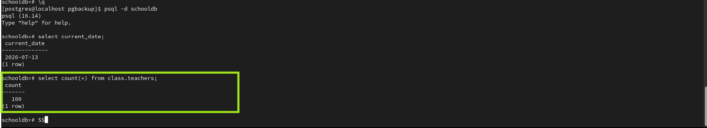

---

# Part 4 - Backup Compression

## Step 11 - Compress and Split Backup

### Purpose

Compress the backup using gzip and split the compressed file into multiple parts.

### Command Syntax

```bash
pg_dump -d <database_name> | gzip > <backup_file.sql.gz>

pg_dump -d <database_name> | split -b <size> <backup_file> <output_prefix>
```

### Evidence

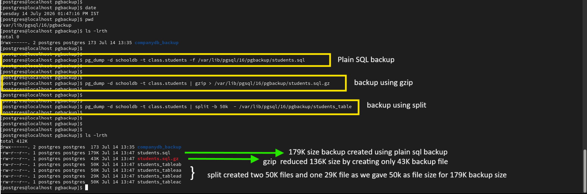

---

## Step 12 - Restore Split Backup

### Purpose

Merge the split files using cat and restore the backup.

### Command Syntax

```bash
cat <output_prefix>* | psql -d <database_name>

```

### Evidence

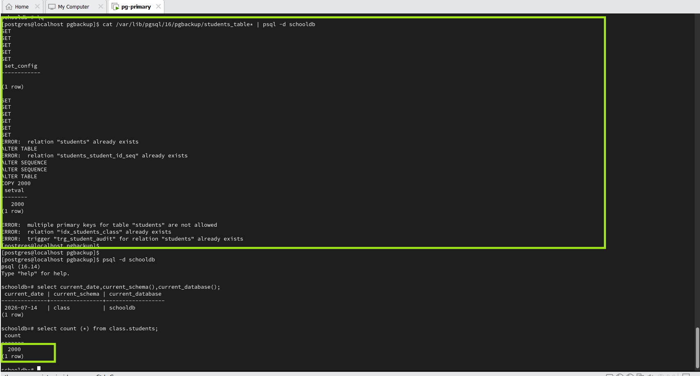

---

## Step 13 - Production Practice

### Purpose

Demonstrate the use of gzip, split, and cat commands to reduce backup size and simplify the transfer of large backup files in production environments.

### Command Syntax
```bash
pg_dump -d <database_name> | gzip | split -b <size> - <output_prefix>
```

### Evidence

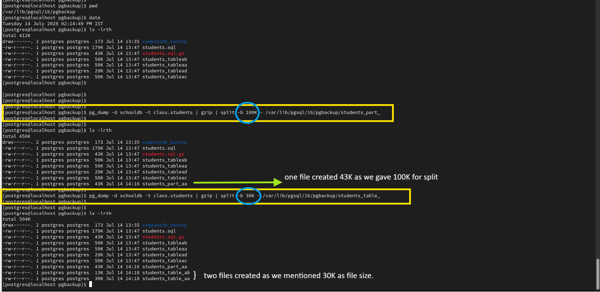

---

# Part 5 - Backup Entire PostgreSQL Cluster

## Step 1 - Backup All Databases

### Purpose

Create a logical backup of the entire PostgreSQL cluster using pg_dumpall.

### Command Syntax

```bash
pg_dumpall -f <output_file.sql>
```

### Evidence

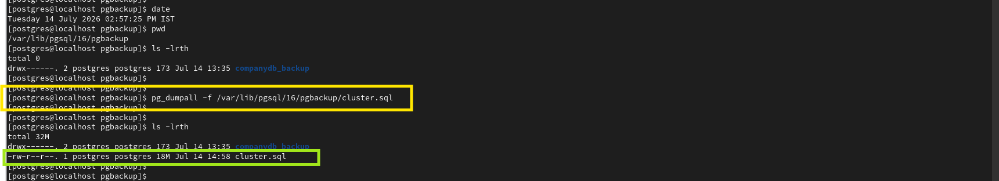

You can use  below option for this for this 

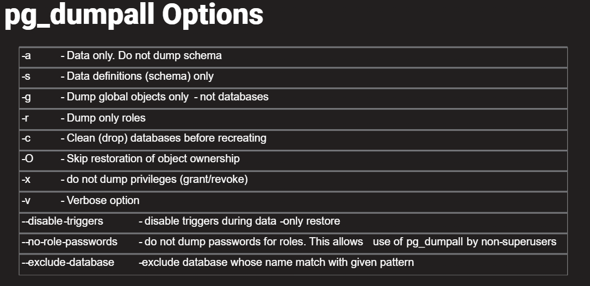
---

## Step 2 - Backup Global Objects

### Purpose

Backup PostgreSQL global objects such as roles and tablespaces.

### Command Syntax

```bash
pg_dumpall --globals-only -f <output_file.sql>
```

### Evidence

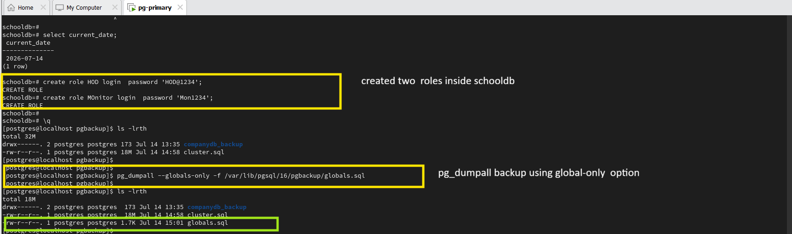

---

## Step 3 - Restore Global Objects

### Purpose

Restore PostgreSQL global objects from the backup.

### Command Syntax

```bash
psql -f <backup_file.sql>
```

### Evidence

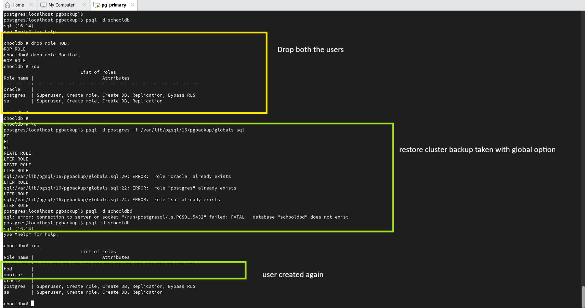

---

# Summary

This lab demonstrated:

- Full database logical backup using **pg_dump**
- Full database restore using **pg_restore**
- Table-level backup and restore
- Database recovery verification
- Backup compression using **gzip**
- Splitting and merging backup files using **split** and **cat**
- Cluster-wide backup using **pg_dumpall**
- Backup and restore of PostgreSQL global objects
