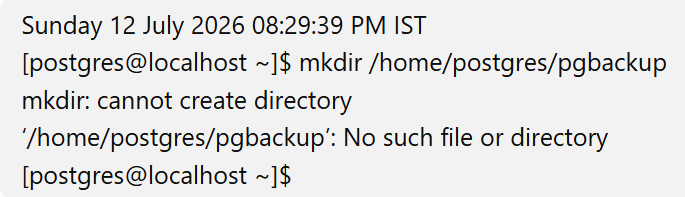

# PostgreSQL Logical Backup and Restore Commands

This document contains the commands used to perform logical backup and restore operations using PostgreSQL utilities.

Each section includes the purpose, command syntax, and evidence captured during the lab.

---

# Part 1 - Prepare Backup Directory

## Step 1 - Create Backup Directory

### Purpose

Create a dedicated directory to store PostgreSQL backup files.

### Commands

```bash
mkdir backup

cd backup
```

### Evidence


---

## Step 2 - Take Full Database Backup (Custom Format)

### Purpose

Create a logical backup of the SchoolDB database using pg_dump in Custom format.

### Command Syntax

```bash
pg_dump -Fc -d schooldb -f schooldb.backup
```

### Evidence


---

## Step 3 - Resolve Backup Path Issue

### Purpose

Resolve the issue encountered while saving the backup in the desired directory.

### Evidence



---

## Step 4 - Verify Backup File

### Purpose

Verify that the custom backup file was created successfully.

### Evidence


---

# Part 2 - Practice Restore Errors

## Step 5 - Simulate Restore Failure

### Purpose

Drop the Students table before restoring to understand common restore errors.

### Evidence


---

## Step 6 - Attempt Restore

### Purpose

Attempt to restore the backup and observe the reported errors.

### Evidence


---

# Part 3 - Restore Entire Database

## Step 7 - Drop Existing Database

### Purpose

Simulate database loss before performing a full restore.

### Command Syntax

```sql
DROP DATABASE schooldb;
```

### Evidence


---

## Step 8 - Restore Database

### Purpose

Restore the complete database using pg_restore.

### Command Syntax

```bash
pg_restore -d schooldb schooldb.backup
```

### Evidence


---

## Step 9 - Verify Database Restore

### Purpose

Verify that all database objects and data were restored successfully.

### Evidence


---

# Part 4 - Backup and Restore Individual Table

## Step 10 - Verify Student Table

### Purpose

Verify the existing data before taking the backup.

### Evidence


---

## Step 11 - Backup Students Table

### Purpose

Create a logical backup of only the Students table.

### Command Syntax

```bash
pg_dump -t class.students
```

### Evidence


---

## Step 12 - Remove Student Data

### Purpose

Truncate the Students table to simulate accidental data loss.

### Evidence


---

## Step 13 - Restore Students Table

### Purpose

Restore the Students table using psql.

### Command Syntax

```bash
psql -f students_backup.sql
```

### Evidence


---

# Part 5 - Backup and Restore Another Table

## Step 14 - Backup Teachers Table

### Purpose

Create a logical backup of the Teachers table.

### Evidence


---

## Step 15 - Remove Teacher Data

### Purpose

Truncate the Teachers table before restoring.

### Evidence


---

## Step 16 - Restore Teachers Table

### Purpose

Restore the Teachers table from the backup.

### Evidence


---

## Step 17 - Verify Teacher Restore

### Purpose

Verify that all teacher records were restored successfully.

### Evidence


---

# Part 6 - Backup Compression

## Step 18 - Compress and Split Backup

### Purpose

Compress the backup using gzip and split the compressed file into multiple parts.

### Command Syntax

```bash
gzip

split
```

### Evidence


---

## Step 19 - Restore Split Backup

### Purpose

Merge the split files using cat and restore the backup.

### Command Syntax

```bash
cat
```

### Evidence


---

## Step 20 - Production Practice

### Purpose

Demonstrate the use of gzip, split, and cat commands to reduce backup size and simplify the transfer of large backup files in production environments.

### Evidence


---

# Part 7 - Backup Entire PostgreSQL Cluster

## Step 21 - Backup All Databases

### Purpose

Create a logical backup of the entire PostgreSQL cluster using pg_dumpall.

### Command Syntax

```bash
pg_dumpall
```

### Evidence


---

## Step 22 - Backup Global Objects

### Purpose

Backup PostgreSQL global objects such as roles and tablespaces.

### Command Syntax

```bash
pg_dumpall --globals-only
```

### Evidence


---

## Step 23 - Restore Global Objects

### Purpose

Restore PostgreSQL global objects from the backup.

### Command Syntax

```bash
psql -f globals.sql
```

### Evidence


---

# Summary

This lab demonstrated:

- Full database logical backup using **pg_dump**
- Full database restore using **pg_restore**
- Table-level backup and restore
- Database recovery verification
- Backup compression using **gzip**
- Splitting and merging backup files using **split** and **cat**
- Cluster-wide backup using **pg_dumpall**
- Backup and restore of PostgreSQL global objects
