# PostgreSQL Physical Backup Commands

This document contains the commands and verification steps used to perform PostgreSQL physical backup operations.

The complete command sequences are available in the **scripts** directory.

---

# Part 1 - Offline (Cold) Backup

## Step 1 - Stop PostgreSQL Server

### Purpose

Stop the PostgreSQL server before taking a filesystem-level backup to ensure all data files are in a consistent state.

### Commands

The complete command sequence is available in:

- `scripts/offline-backup.sh`

### Evidence

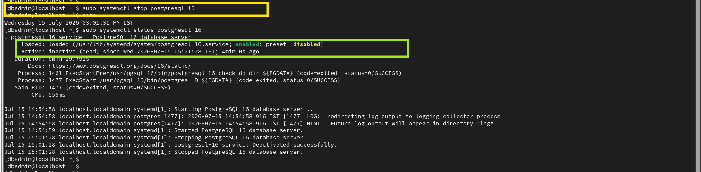

---

## Step 2 - Create Backup Directory and Take Filesystem Backup

### Purpose

Create a backup directory and copy the PostgreSQL data directory while the server is offline.

### Commands

The complete command sequence is available in:

- `scripts/offline-backup.sh`

### Evidence

---

## Step 3 - Verify Offline Backup

### Purpose

Verify that the backup completed successfully and the copied data directory is available.

### Commands

The complete command sequence is available in:

- `scripts/offline-backup.sh`

### Evidence

---

## Step 4 - Start PostgreSQL Server

### Purpose

Start PostgreSQL after the offline backup and verify that the server is running normally.

### Commands

The complete command sequence is available in:

- `scripts/offline-backup.sh`

### Evidence

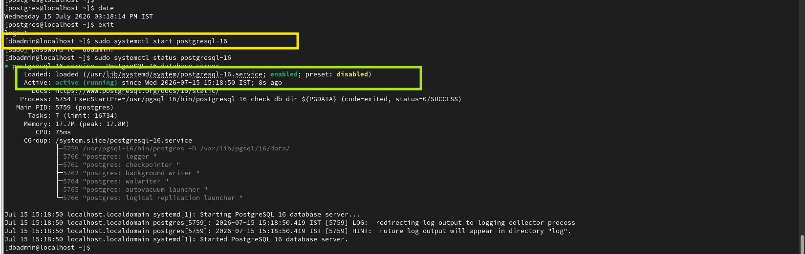

---

# Part 2 - Configure WAL Archiving

## Step 5 - Verify Default WAL Configuration

### Purpose

Review the current PostgreSQL WAL and archiving configuration before enabling archive mode.

### Commands

The complete command sequence is available in:

- `scripts/archive-setup.sh`

### Evidence

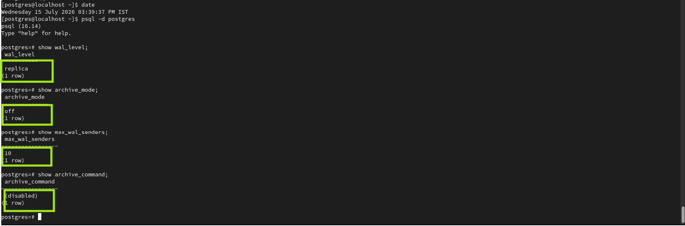

---

## Step 6 - Create Archive Directory

### Purpose

Create the archive directory that will store completed WAL segment files and assign the appropriate ownership.

### Commands

The complete command sequence is available in:

- `scripts/archive-setup.sh`

### Evidence

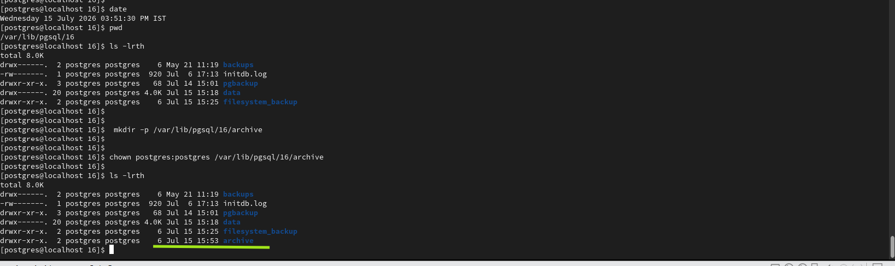

---

## Step 7 - Backup PostgreSQL Configuration File

### Purpose

Create a backup copy of `postgresql.conf` before modifying server configuration parameters.

### Commands

The complete command sequence is available in:

- `scripts/archive-setup.sh`

### Evidence

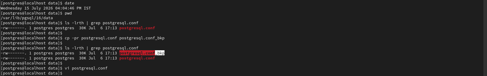

---

## Step 8 - Update WAL Archiving Configuration

### Purpose

Configure WAL archiving parameters and compare the updated configuration with the backup copy.

### Commands

The complete command sequence is available in:

- `scripts/archive-setup.sh`

### Evidence

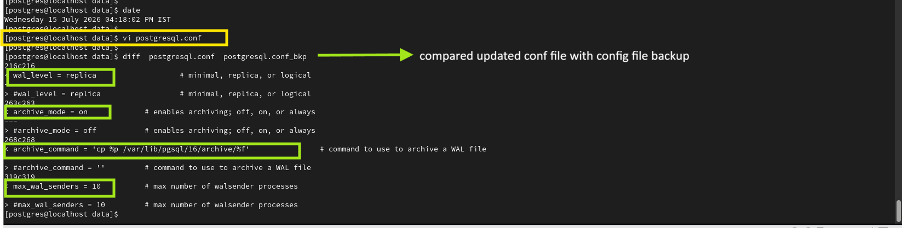

---

## Step 9 - Restart PostgreSQL and Verify Configuration

### Purpose

Restart PostgreSQL and verify that the updated configuration parameters have been applied successfully.

### Commands

The complete command sequence is available in:

- `scripts/archive-setup.sh`

### Evidence

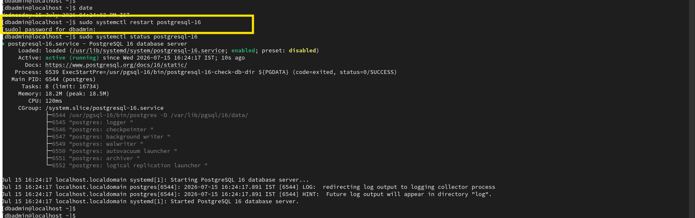

---

## Step 10 - Force WAL Switch

### Purpose

Generate a new WAL segment and verify that completed WAL files are archived successfully.

### Commands

The complete command sequence is available in:

- `scripts/archive-setup.sh`

### Evidence

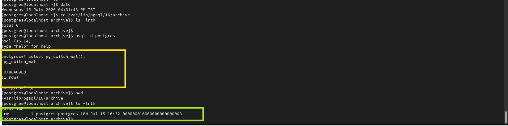

---

## Step 11 - Verify WAL Archiver

### Purpose

Verify the status of the WAL archiver using PostgreSQL system statistics.

### Commands

The complete command sequence is available in:

- `scripts/archive-setup.sh`

### Evidence

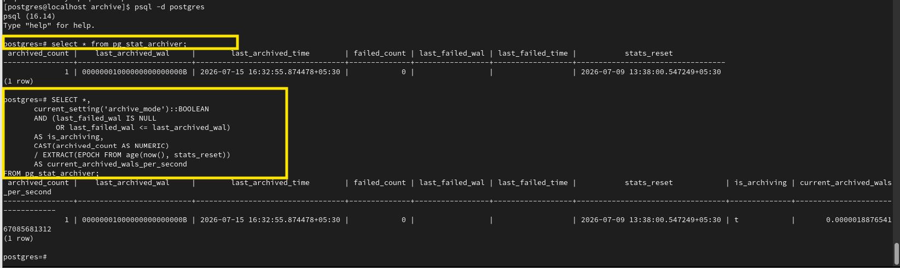

---

# Part 3 - Online Physical Backup Using the Low-Level Backup API

## Step 12 - Create Backup Directory

### Purpose

Create a directory to store the online physical backup.

### Commands

The complete command sequence is available in:

- `scripts/low-level-api-backup.sh`

### Evidence

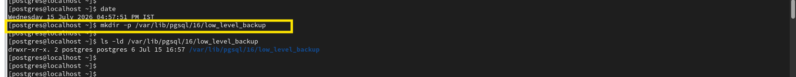

---

## Step 13 - Start Backup Mode

### Purpose

Put PostgreSQL into backup mode before copying the data directory.

### Commands

The complete command sequence is available in:

- `scripts/low-level-api-backup.sh`

### Evidence

---

## Step 14 - Perform Physical Backup

### Purpose

Create a compressed copy of the PostgreSQL data directory while the server remains online.

### Commands

The complete command sequence is available in:

- `scripts/low-level-api-backup.sh`

### Evidence

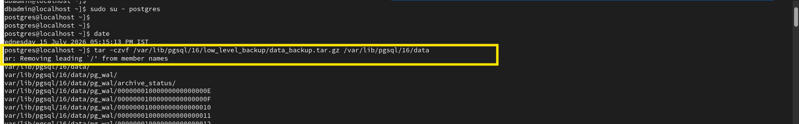

---

## Step 15 - Verify Backup Completion

### Purpose

Verify that the compressed backup archive was created successfully.

### Commands

The complete command sequence is available in:

- `scripts/low-level-api-backup.sh`

### Evidence

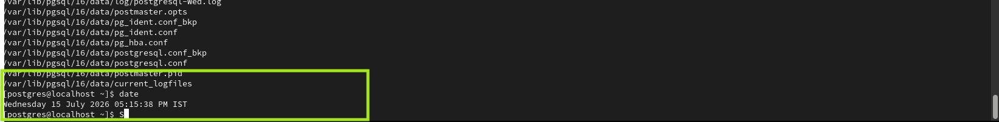

---

## Step 16 - Stop Backup Mode

### Purpose

End backup mode and verify that PostgreSQL completed the online backup successfully.

### Commands

The complete command sequence is available in:

- `scripts/low-level-api-backup.sh`

### Evidence

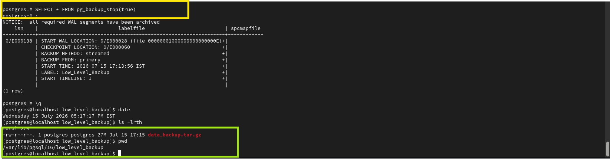

---

# Part 4 - Physical Backup Using pg_basebackup

## Step 17 - Verify Required Configuration

### Purpose

Verify that the PostgreSQL instance is configured to support `pg_basebackup`.

### Commands

The complete command sequence is available in:

- `scripts/pg_basebackup.sh`

### Evidence

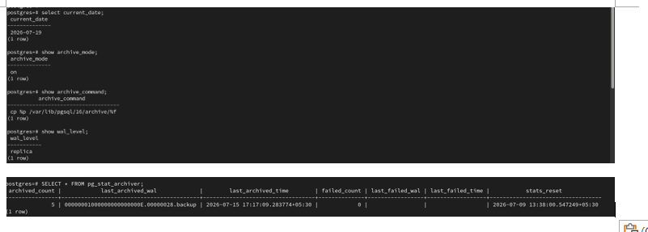

---

## Step 18 - Create Base Backup Directory

### Purpose

Create the destination directory that will store the base backup.

### Commands

The complete command sequence is available in:

- `scripts/pg_basebackup.sh`

### Evidence

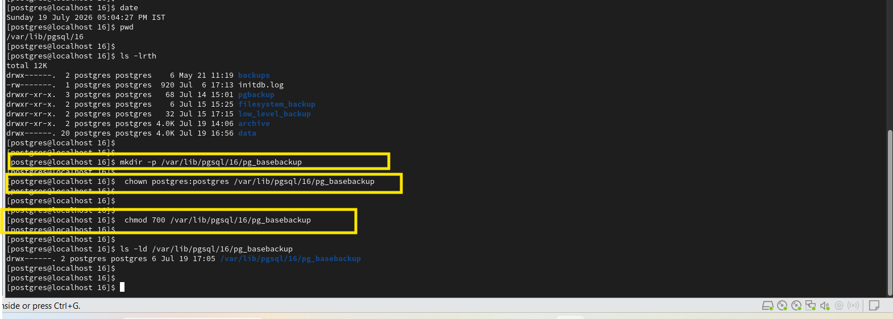

---

## Step 19 - Execute pg_basebackup

### Purpose

Create a consistent online physical backup using the `pg_basebackup` utility.

### Commands

The complete command sequence is available in:

- `scripts/pg_basebackup.sh`

### Evidence

---

# Summary

This lab demonstrates:

- Offline (Cold) filesystem backup
- WAL archiving configuration
- Online backup using the Low-Level Backup API
- Physical backup using `pg_basebackup`
- Backup verification and validation
