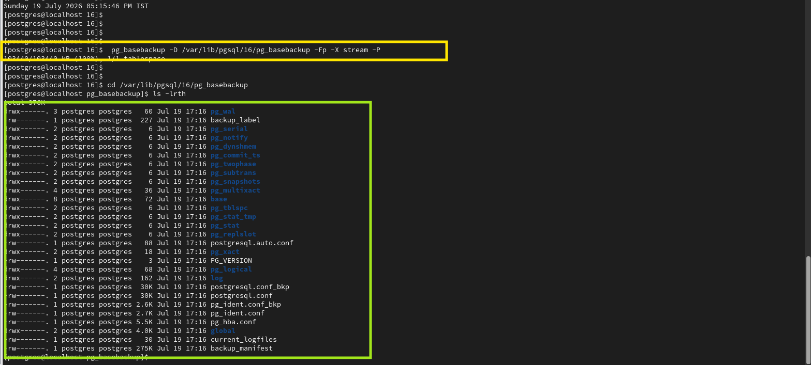
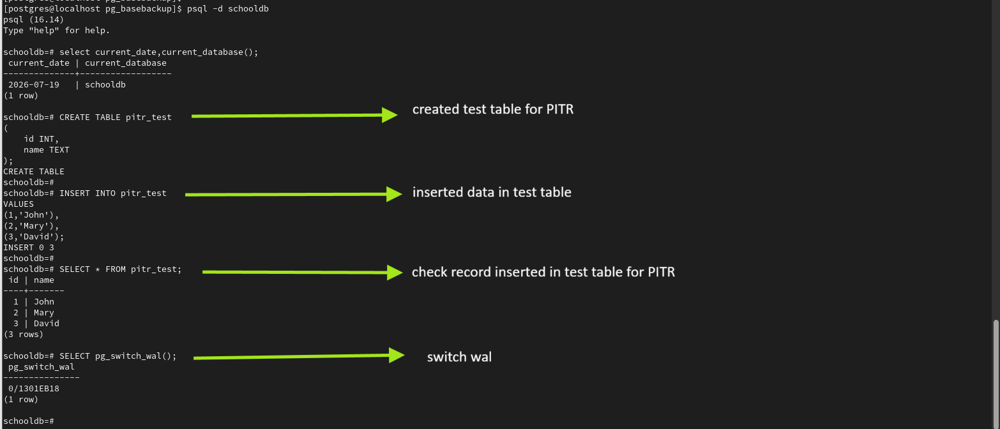
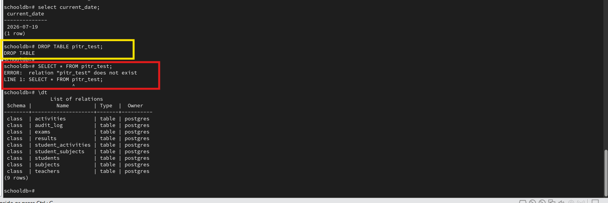
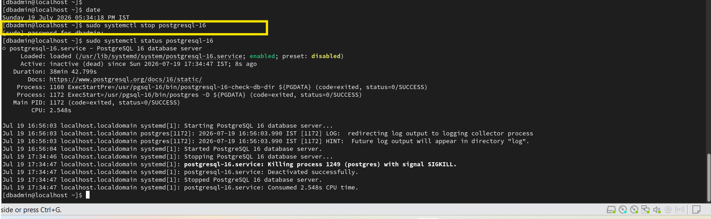
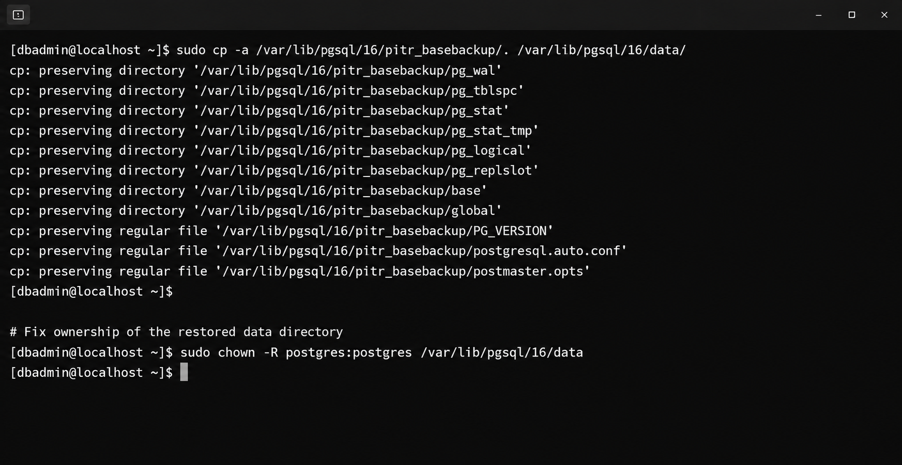
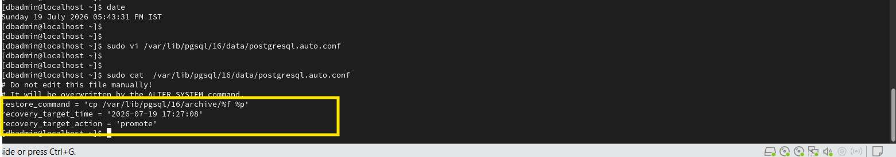
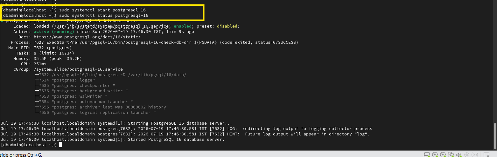
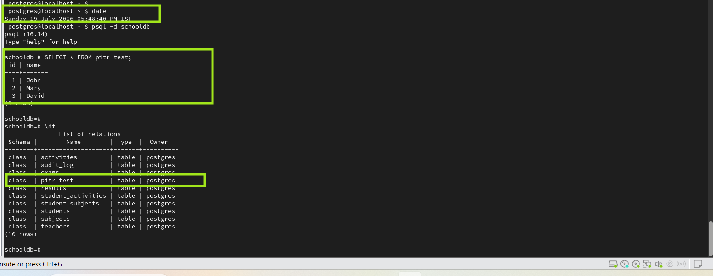

# PostgreSQL Point-in-Time Recovery (PITR) Commands

This document contains the commands used during the PostgreSQL PITR lab.

The lab demonstrates recovery of the `companydb` database to a specific point in time using a physical base backup and archived WAL files.

---

# Step 1 - Verify WAL Archiving

## Purpose

Verify that WAL archiving is enabled and PostgreSQL is configured correctly for PITR.

## Commands

```sql
SHOW wal_level;

SHOW archive_mode;

SHOW archive_command;
```

Check the WAL archiver:

```sql
SELECT archived_count,
       failed_count,
       last_archived_wal,
       last_archived_time
FROM pg_stat_archiver;
```

## Expected

```text
wal_level       | replica
archive_mode    | on
archive_command | cp %p /var/lib/pgsql/16/archive/%f
```

`archived_count` should show successfully archived WAL segments and `failed_count` should not continuously increase.

## Evidence


---

# Step 2 - Create PITR Base Backup

## Purpose

Create a dedicated directory and take a fresh physical base backup that will be used as the starting point for PITR.

## Commands

Create the backup directory:

```bash
sudo mkdir -p /var/lib/pgsql/16/pitr_basebackup

sudo chown postgres:postgres /var/lib/pgsql/16/pitr_basebackup

sudo chmod 700 /var/lib/pgsql/16/pitr_basebackup
```

Take the physical base backup:

```bash
sudo -u postgres pg_basebackup -D /var/lib/pgsql/16/pitr_basebackup -Fp -X stream -P
```

Verify the backup:

```bash
ls -l /var/lib/pgsql/16/pitr_basebackup
```

## Evidence




---

# Step 3 - Generate Initial PITR Test Data

## Purpose

Create a test table and insert initial records that will be available before the selected recovery point.

## Commands

Connect to `companydb`:

```bash
sudo -u postgres psql companydb
```

Create the test table:

```sql
CREATE TABLE pitr_test
(
    id INT,
    name TEXT
);
```

Insert initial records:

```sql
INSERT INTO pitr_test
VALUES
(1,'John'),
(2,'Mary'),
(3,'David');
```

Verify:

```sql
SELECT *
FROM pitr_test;
```

## Evidence



---

# Step 4 - Force WAL Switch and Verify Archiving

## Purpose

Force a WAL segment switch and verify that the WAL archiver is processing WAL files.

## Commands

```sql
SELECT pg_switch_wal();
```

Verify the archiver:

```sql
SELECT archived_count,
       last_archived_wal,
       last_archived_time
FROM pg_stat_archiver;
```

## Evidence


---

# Step 5 - Record Recovery Target Time

## Purpose

Record the timestamp that will be used as the PITR recovery target.

## Command

```sql
SELECT now();
```

Save the timestamp returned by PostgreSQL.

Example:

```text
2026-07-19 18:42:30
```

This timestamp will later be configured as `recovery_target_time`.

## Evidence


---

# Step 6 - Generate Additional Transactions

## Purpose

Generate additional database changes after the recovery target time.

## Commands

Insert additional records:

```sql
INSERT INTO pitr_test
VALUES
(4,'Scott'),
(5,'Allen'),
(6,'James');
```

Verify:

```sql
SELECT *
FROM pitr_test;
```

Force another WAL switch:

```sql
SELECT pg_switch_wal();
```

Verify archiving:

```sql
SELECT archived_count,
       last_archived_wal,
       last_archived_time
FROM pg_stat_archiver;
```

## Evidence


---

# Step 7 - Simulate User Error

## Purpose

Simulate an accidental database operation by dropping the PITR test table.

## Commands

```sql
DROP TABLE pitr_test;
```

Verify:

```sql
\dt
```

The `pitr_test` table should no longer be listed.

## Evidence



---

# Step 8 - Stop PostgreSQL

## Purpose

Stop PostgreSQL before restoring the physical base backup.

## Command

```bash
sudo systemctl stop postgresql-16
```

## Evidence



---

# Step 9 - Move Current Data Directory

## Purpose

Preserve the existing PostgreSQL data directory before restoring the PITR base backup.

## Command

```bash
sudo mv /var/lib/pgsql/16/data /var/lib/pgsql/16/data_old
```

## Evidence


---

# Step 10 - Restore PITR Base Backup

## Purpose

Restore the physical base backup into the PostgreSQL data directory.

## Commands

```bash
sudo cp -a /var/lib/pgsql/16/pitr_basebackup/. /var/lib/pgsql/16/data/
```

Fix ownership:

```bash
sudo chown -R postgres:postgres /var/lib/pgsql/16/data
```
## Evidence



---

# Step 11 - Configure PITR Recovery

## Purpose

Configure PostgreSQL to retrieve archived WAL files and stop recovery at the selected recovery target.

## Command

Edit the PostgreSQL configuration:

```bash
sudo vi /var/lib/pgsql/16/data/postgresql.auto.conf
```

Add:

```text
restore_command = 'cp /var/lib/pgsql/16/archive/%f %p'

recovery_target_time = 'YYYY-MM-DD HH:MM:SS'

recovery_target_action = 'promote'
```

Replace `YYYY-MM-DD HH:MM:SS` with the timestamp recorded in Step 5.

Example:

```text
recovery_target_time = '2026-07-19 18:42:30'
```

## Evidence



---

# Step 12 - Create Recovery Signal

## Purpose

Create `recovery.signal` so PostgreSQL enters recovery when the server starts.

## Commands

```bash
sudo touch /var/lib/pgsql/16/data/recovery.signal
```

Set ownership:

```bash
sudo chown postgres:postgres \
/var/lib/pgsql/16/data/recovery.signal
```

## Evidence


---

# Step 13 - Start PostgreSQL

## Purpose

Start PostgreSQL and allow it to replay the archived WAL files until the configured recovery target is reached.

## Commands

```bash
sudo systemctl start postgresql-16
```

Check the server status:

```bash
sudo systemctl status postgresql-16
```

## Evidence



---

# Step 14 - Verify PITR Recovery

## Purpose

Verify that PostgreSQL recovered the database to the selected point in time.

## Commands

Connect to `companydb`:

```bash
sudo -u postgres psql companydb
```

Check the recovered table:

```sql
SELECT *
FROM pitr_test;
```

Expected:

- The `pitr_test` table exists.
- Data committed before the recovery target is present.
- The `DROP TABLE` operation is not present in the recovered state.

## Evidence



---

# Step 15 - Verify Recovery Completion

## Purpose

Verify that PostgreSQL has completed recovery and is operating as a normal primary server.

## Command

```sql
SELECT pg_is_in_recovery();
```

## Expected

```text
f
```

`f` indicates that PostgreSQL is no longer in recovery mode.

## Evidence


